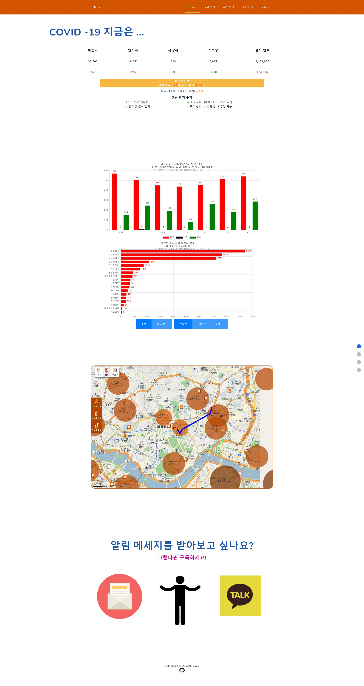
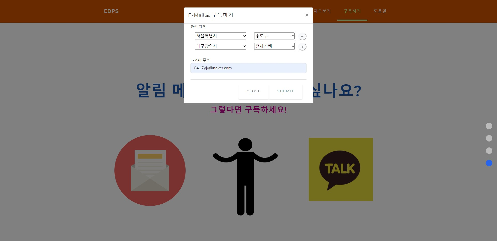

# InfectionMonitoringSystem
2020-2 Software Engineering class project repository in CS at Dongguk University

# About Us
*Team Lumos*
* 윤종연 (팀장)
* 김우주
* 정용헌
* 송승민

# Useful Commands
Checkout branch from other's repository
```
git remote add [coworker] git://path/to/coworkers/repo.git
git fetch [coworker]
git checkout --track [coworker]/[foo]
```
***
Dump database into dbdump.json: 현재 데이터베이스를 dbdump.json파일로 저장
```
(venv) python manage.py dumpdata --natural-foreign --natural-primary --indent=4 -o dbdump.json
```
***
Load database from dumped file: 데이터베이스를 덤프한 파일에서 데이터베이스를 불러옴
```
(venv) python manage.py flush
(venv) python manage.py loaddata dbdump.json
```
***

# Korea Corona API
국내 코로나 API <br>
https://github.com/dhlife09/Corona-19-API 
```
API 키: f14954c4a0b04d9a53b1603e20d40e1b8
국내 카운터 요청 예제: https://api.corona-19.kr/korea/?serviceKey=f14954c4a0b04d9a53b1603e20d40e1b8
시도별 발생동향 요청 예제: https://api.corona-19.kr/korea/country/new/?serviceKey=f14954c4a0b04d9a53b1603e20d40e1b8
```

# References
[chartjs](https://www.chartjs.org/docs/latest/)  
[charjs-plugin-datalabels](https://chartjs-plugin-datalabels.netlify.app/guide/)

# Demo
## 메인 페이지

## 이메일 구독 창
